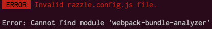

## razzle-webpack-unhandled-error

The purpose of this repository is to showcase a problem with unhandled errors when running the build script provided by Razzle with a problematic Webpack config extended as described [in the docs](https://github.com/jaredpalmer/razzle#extending-webpack). 

In the example, I've used `postinstall-postinstall` and `patch-package` to debug the module directly, and apply the small fix to the try-catch block in the build script.

Before the patch there was no errors displayed, but the plugin wasn't added to the configuration.

The error is now displayed after the applied patch:

An issue in the repository will be raised with the applied fixed.
